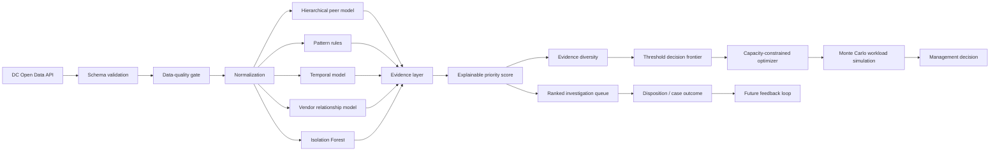

# Procurement Decision Intelligence

> **Advanced Business Analysis + analytics portfolio case:** transforming public purchase-card transactions into a governed exception-management product with explainable risk signals, vendor-relationship intelligence, capacity optimization, and workload-risk simulation.

[](https://www.python.org/)
[](#engineering-quality)
[](app.py)
[](https://catalog.data.gov/dataset/purchase-card-transactions)
[](LICENSE)

**Amir Sheikh** — MSc Economic and Business Analytics, JKU Linz · former statutory compliance auditor
[LinkedIn](https://linkedin.com/in/amir-sheikh1) · amir.h.sheikh1998@gmail.com

## Executive problem

A control team can have thousands of transactions but only a limited number of analyst hours. A flat rule list creates two management problems:

1. **What deserves investigation first?**
2. **Where should the review threshold be set so risk coverage and analyst capacity are balanced?**

This project treats that as a **Business Analysis and operating-model problem**, not merely an anomaly-detection exercise.

> **Decision statement:** Given a finite weekly review capacity, choose the lowest defensible priority threshold that maximizes coverage of multi-dimensional exception evidence without creating an unsustainable queue.

The output is a ranked, explainable review queue plus a management decision frontier showing the trade-off between coverage, workload, and evidence diversity.

## Why this project bridges Audit → Business Analysis

My audit background provides strengths in risk, evidence, control design, root-cause thinking and professional skepticism. The project converts those strengths into BA deliverables:

- problem framing and scope boundaries;
- stakeholder decision mapping;
- functional and non-functional requirements;
- AS-IS / TO-BE process redesign;
- business rules and acceptance criteria;
- KPI and control governance;
- analytics translated into operational decisions;
- traceability from requirement → implementation → test → business outcome.

The project deliberately avoids claiming that an exception is fraud or wrongdoing. It is a **screening and prioritization product**.

---

## Data source

**Washington, DC Purchase Card Transactions** from DC Open Data / Office of Contracting and Procurement. It contains transaction-level fields including agency, date, amount, vendor, vendor location and merchant-category description.

**Source:** https://catalog.data.gov/dataset/purchase-card-transactions

The dataset is useful because there is **no supplied fraud label**. The analyst must define the business problem, design evidence signals, manage ambiguity, and establish governance rather than optimizing against a pre-built answer key.

---

## Results from the committed sample run

The repository ships an executed run so the outputs can be read in the browser without
installing anything: [`data/sample_run/`](data/sample_run/), including the full
[185-case review queue](data/sample_run/recommended_review_queue.csv) with a reason code and
score breakdown on every row.

> **This run uses synthetic data.** Agencies and vendors are generated and prefixed
> `SYNTHETIC`. Nothing here is a finding about the District of Columbia or any real
> organisation. It demonstrates the mechanism, not accuracy — see
> [`data/sample_run/README.md`](data/sample_run/README.md).


The headline result is a governance finding, not a modelling one:

| Question | Answer from the run |
|---|---|
| Lowest threshold meeting the evidence-diversity constraint | **47** |
| Alerts selected | 185 |
| Deterministic workload at 12 min/review | **37.0 h** — inside the 40 h capacity |
| Monte Carlo P90 workload | **45.5 h** |
| Probability the queue exceeds capacity | **95.2%** |
| Top-100 queue stability under perturbed weights (mean Jaccard) | 0.82 |

A single average review time says the threshold is affordable. Simulating the long tail of
complex cases says it will overflow in 19 weeks out of 20. That gap is the whole argument for
treating a control threshold as a capacity decision rather than a modelling parameter.


Two bulky intermediate files are regenerated rather than committed — see
[`data/sample_run/README.md`](data/sample_run/README.md). A test asserts a fresh run
reproduces the committed queue byte-for-byte.

The engine ranked the injected split-payment pattern — repeated amounts just under the
scenario review threshold, same vendor, same agency, within days — into the top positions
without being told the pattern existed.

---

# What makes version 2 advanced

## 1. Hierarchical peer benchmarking

A transaction amount is compared against the most relevant peer group available:

```text
Agency + Merchant Category
        ↓ if peer group too small
Merchant Category across agencies
        ↓ fallback
Agency-wide transactions
```

The model uses robust statistics rather than ordinary mean/standard deviation, reducing sensitivity to extreme values.

## 2. Pattern and temporal intelligence

The engine identifies:

- near-duplicate agency/vendor/amount activity;
- same-day vendor bursts;
- rare agency–merchant-category combinations;
- weekend activity;
- round-dollar amounts;
- proximity to a configurable scenario threshold;
- vendor monthly-spend spikes against trailing history;
- vendor relationships that are new **within the observed dataset**.

## 3. Vendor relationship intelligence

The model does not treat each transaction in isolation. It evaluates the agency/vendor relationship:

- **vendor concentration** — how much of an agency's observed spend flows to a vendor;
- **cross-agency reach** — how broadly a vendor appears across agencies;
- relationship transaction counts;
- observed relationship age.

This allows investigation of structural patterns that a simple transaction dashboard misses.

## 4. Multivariate anomaly model

An Isolation Forest evaluates unusual combinations of:

- log transaction amount;
- vendor frequency;
- merchant-category frequency;
- agency frequency;
- day of week;
- vendor share of agency spend;
- relationship age.

It is one input into the decision model, not an oracle.

## 5. Evidence diversity

A high score caused by several correlated amount rules is not treated as equivalent to a high score supported by independent evidence families.

Signals are mapped to families such as:

```text
Magnitude | Pattern | Context | Timing | Network | Temporal | Relationship | Multivariate
```

The system stores `signal_family_count` and an `evidence_confidence` indicator. This is **confidence in evidence diversity**, not probability of misconduct.

## 6. Explainability card

Every ranked transaction retains:

- component signals;
- human-readable reason codes;
- top weighted score contributors;
- number of independent evidence families;
- priority band.

A reviewer can understand why an item reached the queue without reverse-engineering the model.

## 7. Management threshold optimization

Instead of choosing a score threshold arbitrarily, the system creates a decision frontier:

| Threshold | Alerts | Review hours | Priority-score coverage | Multi-family rate |
|---:|---:|---:|---:|---:|
| lower | more | higher | higher | varies |
| higher | fewer | lower | lower | generally stronger |

The optimizer recommends the **lowest feasible threshold** under explicit analyst-capacity and evidence-diversity constraints.

`priority-score coverage` is a decision proxy, not detection accuracy, because the public dataset has no ground-truth outcome label.

## 8. Monte Carlo workload risk

A fixed “12 minutes per review” assumption is too simplistic. Complex cases create long-tail review times.

The project therefore simulates thousands of possible review-time outcomes and reports:

- median workload hours;
- 90th-percentile workload hours;
- analyst capacity;
- probability that the queue exceeds capacity.

This changes the management question from:

> “How many alerts do we have?”

into:

> “What is the probability that this control setting creates an operational backlog?”

## 9. Weight-sensitivity stress testing

The score weights are business judgments, so the model explicitly tests whether the top investigation queue remains stable when those weights are reasonably perturbed. A Dirichlet-based simulation recalculates the top-N queue and measures Jaccard overlap with the governed baseline.

This adds a **model-risk challenge layer**: management can see whether the queue is robust or highly dependent on subjective weighting.

## 10. Data-quality gates

The pipeline produces a quality-control report and can fail before scoring when critical controls break, including:

- missing required columns;
- duplicate transaction IDs;
- non-numeric amount failures;
- material null-rate warnings.

## 11. Interactive management cockpit

`app.py` provides four views:

1. **Executive decision** — score threshold, workload and decision frontier.
2. **Investigation queue** — filterable ranked cases and explainability cards.
3. **Vendor relationships** — dependency and cross-agency reach analysis.
4. **Data quality & governance** — control status and model governance information.

---

# End-to-end architecture



---

# Business Analysis deliverables

| Artifact | Why it matters |
|---|---|
| [`docs/BRD.md`](docs/BRD.md) | business problem, scope, requirements and decision rules |
| [`docs/PROCESS.md`](docs/PROCESS.md) | AS-IS / TO-BE operating-model redesign |
| [`docs/STAKEHOLDERS.md`](docs/STAKEHOLDERS.md) | stakeholder needs, influence and decisions |
| [`docs/USER_STORIES.md`](docs/USER_STORIES.md) | user stories and acceptance criteria |
| [`docs/KPI_DICTIONARY.md`](docs/KPI_DICTIONARY.md) | KPI definitions and interpretation controls |
| [`docs/RISK_CONTROL_MATRIX.md`](docs/RISK_CONTROL_MATRIX.md) | risk → control → evidence → response mapping |
| [`docs/REQUIREMENTS_TRACEABILITY.md`](docs/REQUIREMENTS_TRACEABILITY.md) | requirement → code → test → output traceability |
| [`docs/MODEL_GOVERNANCE.md`](docs/MODEL_GOVERNANCE.md) | model risk, change control and limitations |
| [`docs/DATA_CONTRACT.md`](docs/DATA_CONTRACT.md) | expected source schema and quality rules |
| [`docs/DECISION_LOG.md`](docs/DECISION_LOG.md) | analytical and product decision history |
| [`docs/CASE_SUMMARY.md`](docs/CASE_SUMMARY.md) | short problem → approach → outcome narrative |

---

# Repository structure

```text
.
├── .github/workflows/tests.yml   # CI: runs the full test suite on every push
├── app.py                        # Streamlit management cockpit
├── data/
│   └── sample_run/               # committed synthetic run — reviewable in the browser
├── docs/
│   ├── BRD.md                    # business requirements
│   ├── DATA_CONTRACT.md
│   ├── DECISION_LOG.md
│   ├── CASE_SUMMARY.md
│   ├── KPI_DICTIONARY.md
│   ├── MODEL_GOVERNANCE.md
│   ├── PROCESS.md                # AS-IS / TO-BE
│   ├── REQUIREMENTS_TRACEABILITY.md
│   ├── RISK_CONTROL_MATRIX.md
│   ├── STAKEHOLDERS.md
│   ├── USER_STORIES.md
│   └── img/                      # figures rendered from the sample run
├── notebooks/
├── sql/analysis.sql              # the same logic expressed in ANSI SQL
├── src/
│   ├── config.py                 # governed weights, thresholds, signal families
│   ├── data.py                   # ingestion + schema validation
│   ├── engine.py                 # signals, scoring, banding
│   ├── explain.py                # reason codes + evidence diversity
│   ├── figures.py                # documentation figures
│   ├── network.py                # vendor relationship features
│   ├── optimizer.py              # decision frontier + Monte Carlo workload
│   ├── pipeline.py               # orchestration (live and --sample modes)
│   ├── quality.py                # data-quality gate
│   ├── sample.py                 # synthetic fixture generator
│   └── sensitivity.py            # weight stress test
├── tests/
├── LICENSE
├── Makefile
├── pyproject.toml
└── requirements.txt
```

---

# Run the project

```bash
python -m venv .venv
source .venv/bin/activate   # Windows: .venv\\Scripts\\activate
python -m pip install -r requirements.txt
```

**Offline (no network, reproducible in about a minute):**

```bash
python -m src.pipeline --sample --out data
streamlit run app.py
```

**Against the live source:**

```bash
python -m src.pipeline
streamlit run app.py
```

The live mode calls the DC Open Data ArcGIS endpoint. If that endpoint is unavailable or its
schema has changed, the ingestion controls fail loudly rather than silently producing a
degraded result — use `--sample` to review the pipeline in that case.

The pipeline writes:

```text
data/raw_purchase_card.csv
data/data_quality_report.csv
data/processed_ranked_exceptions.csv
data/agency_summary.csv
data/control_capacity_simulation.csv
data/threshold_decision_frontier.csv
data/management_decision.json
```

The committed run under `data/sample_run/` is a trimmed subset of these — see its README.

---

# Engineering quality

```bash
python -m pytest -q
```

Current suite: **17 passing tests** covering:

- schema validation;
- duplicate detection;
- score bounds;
- duplicate-pattern detection;
- network/temporal feature bounds;
- explainability output;
- evidence-diversity output;
- threshold frontier monotonicity;
- capacity-constrained optimizer behavior;
- reproducible Monte Carlo simulation;
- weight-sensitivity reproducibility and bounds;
- data-quality failure conditions;
- offline pipeline entry point writing all seven artifacts;
- byte-for-byte reproducibility of the committed review queue.

GitHub Actions executes the same test suite on pushes and pull requests.

---

# How to read this repository in 5 minutes

1. Read the **Executive problem**.
2. Open the **BRD** and **traceability matrix** to see the BA work.
3. Inspect `src/engine.py` for multi-layer analytical logic.
4. Inspect `src/optimizer.py` for the management decision model.
5. Launch `app.py` and explore the decision frontier and ranked queue.
6. Read `docs/MODEL_GOVERNANCE.md` to see limitations and control discipline.
7. Read `docs/CASE_SUMMARY.md` for the business outcome narrative.

---

# What I would do in a real organization next

The next production step is **not simply a more complex model**. It is to obtain structured investigation dispositions and control outcomes. That would support:

- validated precision/yield metrics;
- supervised learning only when labels are trustworthy;
- score calibration;
- drift monitoring;
- agency-specific thresholds;
- reviewer assignment and SLA management;
- root-cause actions and benefits tracking;
- formal model/control-owner approval.

That distinction is intentional: technical sophistication should serve the business decision, not replace it.

## Interpretation control

An exception score is a prioritization signal, **not evidence of fraud, policy breach, or misconduct**. Public transaction data lacks investigation context, supporting documentation and ground-truth dispositions. All outputs require human review and appropriate evidence.
