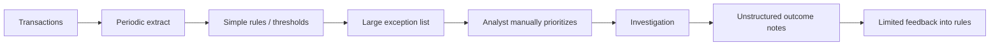
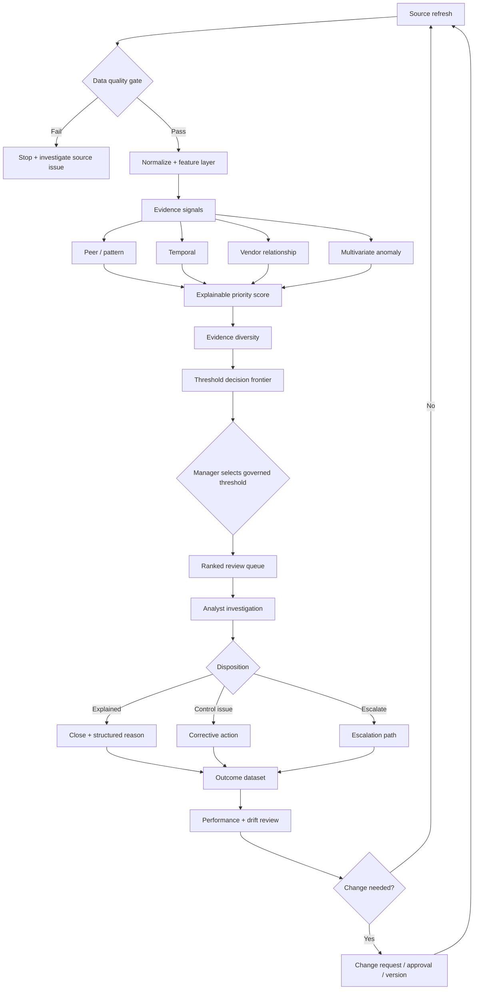

# Current-State and Future-State Process

## AS-IS hypothesis

This portfolio case does **not** claim to describe DC's actual internal procedure. The AS-IS model is a realistic working hypothesis used to demonstrate BA process analysis.

### AS-IS pain points

1. Alert creation and prioritization are mixed together.
2. Single-rule exceptions can create high noise.
3. Reviewer capacity is implicit rather than modeled.
4. Relationship and temporal context are difficult to see manually.
5. Analytical assumptions may not be version controlled.
6. Dispositions may not create structured feedback.
7. Management cannot easily see the risk/workload trade-off.

## TO-BE operating model

## Role design

| Activity | Analyst | Control Manager | Data/BI | Governance Owner |
|---|---|---|---|---|
| Source quality | C | I | R/A | I |
| Rule/model maintenance | C | C | R | A |
| Threshold approval | I | R/A | C | C |
| Case investigation | R | A | I | I |
| Disposition quality | R | A | I | C |
| Model/change approval | C | C | R | A |
| KPI review | C | R/A | C | C |

R = Responsible, A = Accountable, C = Consulted, I = Informed.

## Process controls

| Stage | Control | Failure prevented | Evidence |
|---|---|---|---|
| Ingestion | schema + quality gate | scoring corrupted source data | data-quality report |
| Feature calculation | automated tests | silent analytical regressions | CI results |
| Scoring | versioned weights/config | uncontrolled score change | model version / commit |
| Threshold | explicit capacity decision | unsustainable queue | decision frontier / approval |
| Investigation | reason codes + evidence | opaque escalation | case record |
| Disposition | mandatory structured outcome | lost feedback | disposition dataset |
| Tuning | controlled change process | ad hoc model drift | change request / decision log |
